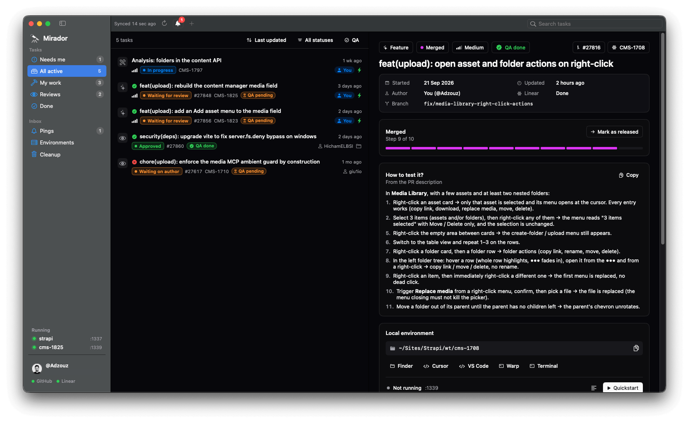
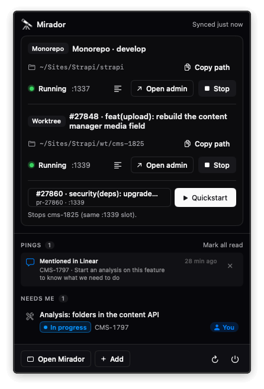

# Mirador 🔭

<p align="center">
  
  &nbsp;
  
</p>

A native macOS app that keeps track of everything you do on the [Strapi monorepo](https://github.com/strapi/strapi):
your fixes and features, the PRs you review, community PRs you take over — and the local worktrees and dev servers
you use to test them.

It comes as a full desktop app (task list, details, environments, pings, cleanup, settings) and a companion in the
menu bar for the essentials at a glance: what needs you, your latest pings, and starting or stopping an environment.

Statuses move on their own from GitHub and Linear, AI agents (Claude Code…) report the steps nobody else can see,
and you get one place to answer "what am I working on, what is waiting on me, and how do I run it locally?".

> Mirador is a community tool built by people working on Strapi. It is not an official Strapi product.

## Features

- **Desktop app + menu bar** — the window holds the full list, task details, environments and cleanup; the 🔭 menu
  bar panel shows what needs you, unread pings and running environments, with Quickstart one click away.
- **One list for all your work** — PRs you authored, PRs you review (team and community), Linear tickets and new
  local branches, each with a status that follows the real state of the PR:
  - your PRs: draft → waiting for review → changes requested → addressing → approved → merged
  - your reviews: to review → reviewing → waiting on author → re-review → approved → merged
  - [docs/STATUSES.md](docs/STATUSES.md) explains every rule
- **Sync** — GitHub every minute through your `gh` login (reviews, comments, commits, CI checks, `qa-done` /
  `qa-skipped` labels, "How to test it?" from the PR description); Linear optionally (assigned and started tickets,
  priorities, mentions).
- **Pings** — a notification when someone asks for your review, mentions you, updates a PR you review, when CI turns
  red on your PR, or when your Linear key stops working.
- **Local testing in one click** — create a git worktree for any PR (forks included), then **Quickstart** runs
  `yarn watch` + `yarn develop --watch-admin`. The monorepo and one worktree run side by side on their own ports, so you
  can compare before / after. First start installs and builds, with progress. Optionally creates your super admin.
- **Cleanup** — find local branches and worktrees whose PR is merged or closed (squash merges included) and delete
  them in bulk, with confirmation and safety rules.
- **For AI agents** — a `mirador` CLI and a Claude Code skill so agents update tasks, create worktrees and start
  environments for you. See [docs/AGENTS_INTEGRATION.md](docs/AGENTS_INTEGRATION.md).
- **Auto-updates** — release builds update themselves (Sparkle); Mirador → Check for Updates….
- Sorting, filters (status, QA), priority, notes, quick links to the PR, the Linear ticket, Finder, your editor or terminal.

## Requirements

- macOS 14 or later
- [GitHub CLI](https://cli.github.com) signed in: `gh auth login`
- A clone of `strapi/strapi` (Mirador looks for it in `~/strapi`, `~/code/strapi`, `~/Developer/strapi`,
  `~/Projects/strapi`, `~/Sites/strapi`… and lets you pick another folder)
- Node and Yarn as required by the monorepo, available in a login shell (Volta, nvm, Homebrew… all work)
- Optional: a [Linear personal API key](https://linear.app/settings/account/security)

## Install

### From a release

1. Download `Mirador-<version>.dmg` from the [latest release](../../releases/latest) and drag Mirador to Applications.
2. The build is not notarized yet: open it the first time with **right-click → Open**.
3. Follow the setup checklist (also under **Mirador → Set Up Mirador…**): GitHub, Linear, folders and ports,
   the `mirador` command-line tool and the Claude Code skill.

### From source

Requires Xcode 16 or later (Swift 6 toolchain).

```sh
git clone <this repo> mirador && cd mirador
./scripts/install.sh      # builds ~/Applications/Mirador.app and links ~/.local/bin/mirador
```

`./scripts/make-dmg.sh` builds a universal (Apple silicon + Intel) `dist/Mirador-<VERSION>.dmg`.

## Settings

| Setting | Default | Notes |
| --- | --- | --- |
| Monorepo | detected `strapi/strapi` clone | Also started from Quickstart as "Monorepo". |
| Worktrees folder | `<monorepo parent>/strapi-worktrees` | New worktrees go here; any checkout in it is listed. |
| Quickstart app | `examples/getstarted` | Relative to each checkout. |
| Monorepo / worktree ports | `1338` / `1339` | Must differ to run both. |
| Linear API key | — | Stored in the Keychain. |
| Linear workspace / team keys | `strapi` / `CMS` | Builds ticket links; keys are found in branch names (`fix/cms-123-…`). |
| Local super admin | off | Created on a fresh app's first start; password in the Keychain. |

## Command line

```sh
mirador start --kind fix --title "Fix upload progress" --linear CMS-123
mirador status done-locally
mirador add https://github.com/strapi/strapi/pull/12345
mirador worktree 12345           # git worktree + gh pr checkout
mirador env start ../strapi-worktrees/pr-12345
mirador guide                    # rules for AI agents
```

`mirador help` lists every command; [docs/CLI.md](docs/CLI.md) describes them.

## Privacy and what Mirador writes

- Everything is local: tasks in `~/Library/Application Support/Mirador/store.json`, secrets in the macOS Keychain,
  logs in `~/Library/Logs/Mirador/`.
- GitHub is read through your own `gh` login. The only thing Mirador writes to GitHub is the `qa-done` /
  `qa-skipped` label, and only when you change a task's QA mark.
- Locally it only runs git commands you trigger: creating worktrees, and deleting the branches / worktrees you select
  in Cleanup. It never commits, pushes or comments.

## Development

```sh
swift build && swift test
```

- [docs/ARCHITECTURE.md](docs/ARCHITECTURE.md) — how the pieces fit
- [AGENTS.md](AGENTS.md) — conventions and gotchas, for humans and AI agents working on this codebase
- [CONTRIBUTING.md](CONTRIBUTING.md) · [docs/RELEASING.md](docs/RELEASING.md)

## License

[MIT](LICENSE)
